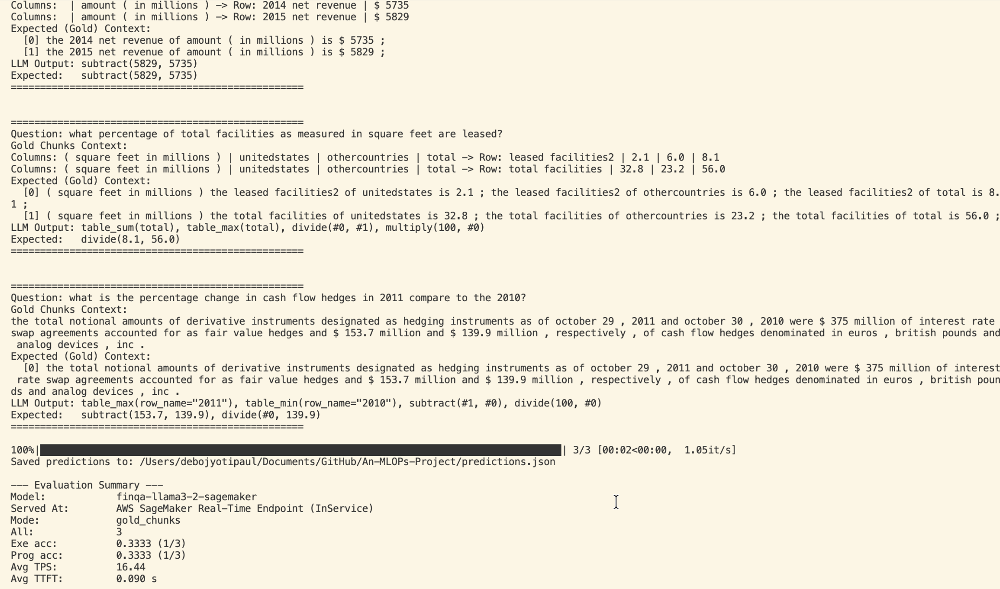
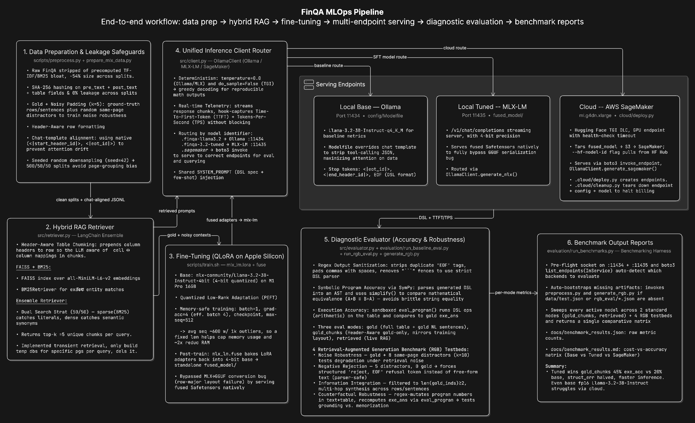
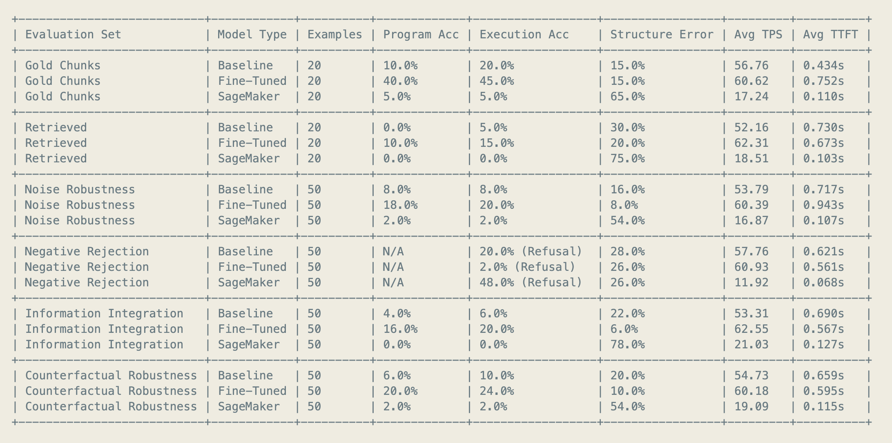

# FinQA MLOps Pipeline

## Overview
I built this project to set up a simple MLOps workflow. I choose to use the Llama-3.2-3B-Instruct-4bit model and tried numerical reasoning over financial reports (FinQA dataset,which simulated typical financial metric retrieval with tables and texts). I performed simple intentional fine-tuning and built an instrumented platform to measure and compare the latency, throughput, and accuracy trade-offs between running models locally (via Ollama and MLX-LM on Apple Silicon) and in the cloud (using AWS SageMaker real-time endpoints).

  

## How it works
Here's the data flow of the MLOps pipeline:

  

## Where Everything Is
To keep the project organized, I split it into a few core folders:
* [src/](src/): Contains the core code, like the hybrid retriever ([retriever.py](src/retriever.py)), endpoint client ([client.py](src/client.py)), and mathematical evaluator ([evaluator.py](src/evaluator.py)).
* [scripts/](scripts/): Houses offline scripts for preparing the training datasets ([prepare_mlx_data.py](scripts/prepare_mlx_data.py)) and running the local training job ([train.sh](scripts/train.sh)).
* [evaluation/](evaluation/): Contains the benchmark scripts, including the baseline evaluator ([run_baseline_eval.py](evaluation/run_baseline_eval.py)), RGB testbed generator ([generate_rgb.py](evaluation/generate_rgb.py)), and the main benchmark harness ([run_benchmarks.py](evaluation/run_benchmarks.py)).
* [cloud/](cloud/): Holds the AWS SageMaker deployment ([deploy.py](cloud/deploy.py)) and cleanup scripts ([cleanup.py](cloud/cleanup.py)).
* [docs/](docs/): Place for generated performance plots, walkthroughs, and detailed reports.

You can also read the [Setup & Getting Started Guide](docs/gettingstarted.txt) or check out the [Technical Walkthrough](docs/walkthrough.md) for more details.

## Performance
Ollama also collected logs of the local API endpoints as evaluations were running, so I wrote a quick script to parse those logs and plot our performance across different dimensions. Here are 3 interesting plots:

### Autoregressive Token Generation Scaling

*Takeaway:* Autoregressive generation scales linearly with output tokens, confirming zero memory-bound latency decay during decoding.

### Latency vs. Input Context Size

*Takeaway:* Prompt processing (pre-fill) time increases linearly with context length, which is why keeping our retrieved context brief (by capping noisy distractors) is so important to keep latency low.

### Throughput Stability Over Sequence

*Takeaway:* Local Metal execution stays incredibly stable (~60 TPS) over extended batch inference runs without thermal throttling.

*(For a deeper dive into the numbers, check out the full [Ollama Caching & Performance Report](docs/ollama_metrics_report.md)).*

## Benchmark Results
Here is the complete benchmark table showing results for both baseline and fine-tuned models across all evaluation runs (compiled in [benchmark_results.md](docs/benchmark_results.md)):

  

*Caveat: Sagemaker here is running L3.2-3B-I-16bit instead of 4bit due to unsupported MLX architecture on AWS, and no access to meta official weights. Worse inference is expected due to larger model size on similar(but cloud) grade resource.*

### Takeaways and Assumptions
* **Fine-Tuning works:** The local Fine-Tuned model made a massive leap on Gold Chunks, bringing Execution Accuracy from 20% to 45%(on small test set). This shows the model was able to pick up on some DSL structure directly in its weights.
* **Retriever is not the best but not the worst:** In Retrieved mode (where we ran the actual ensemble search), accuracy dropped off. The retriever likely pulled in distractors and numbers that the model got confused by or never pulled correct chunks. Our **retriever eval**-`check_recall.py` told us it was accurate only ~80% of the time and only 75% of the time grabbed all the correct chunks(gave full context) for the question.
* **The SageMaker Chat Template :** The baseline 16bit model running on AWS SageMaker hit structure error rates of 65% to 78%. I assume this was due to the Hugging Face TGI serving container not applying the exact chat template formatting that Ollama automatically handles locally. It resulted in the model failing to output valid math commands. (still saw system msg but as a simple prompt instead.)
* **SFT improves effective throughput (TPS) and trade-off with TTFT:** We notice about 8-12% improvement in TPS, this can be attributed to a combination of factors: lower entropy since model somewhat knows what pool of responses we want, lower internalizing the style and knowledge of task(smaller kv cache), and also avoiding verbose chatter and filler text, all of which can dramatically lowering overall response latency and raising the *effective* TPS (tokens processed and generated per second of user wait time). Faster TTFT on some tests may also support the above claims.

## Experience
I decided to run the entire training and testing pipeline locally on an Apple M1 Pro laptop with 16GB RAM. This meant I was highly constrained by VRAM, which forced me to make some interesting optimization choices.

First, to fit fine-tuning in memory, I set the training batch size to 1 and accumulated gradients over 4 steps, which simulates a batch size of 4 without blowing up VRAM. I also limited the max sequence length to 512 tokens. This was a critical decision—the average sequence length in our dataset was around 600, but there were outliers up to 1,000 tokens. If I hadn't capped it at 512, those outliers would have doubled my VRAM requirements on the fly and crashed the training job midway.

I also ran into a major GGUF export bug: after training the model using the MLX framework, trying to convert the fused weights to GGUF format for Ollama crashed because I think MLX transposes some weights during fusion. Instead of losing days trying to fix the compiler's exporters, I bypassed GGUF entirely. I served the model natively using the `mlx_lm.server` framework on port 11435, and routed the evaluation client there instead.

Additionally, I realized that simple string matching for evaluation is useless for math (e.g., comparing `A + B` to `B + A` fails even though they are identical). I instead integrated SymPy to parse the Abstract Syntax Trees (ASTs) of the generated formulas so they are evaluated mathematically.

I learned using Hugging Face(models specific) chat templates with control tokens (like `<|start_header_id|>` and `<|eot_id|>`), and excluding unused tokens(tool calling func) may've helped in avoiding some attention weights drift, but could've also caused it in base models. I also learned I had to restructure the preprocessing pipeline to save datasets as a structured JSON array of messages (system, user, assistant), allowing the MLX training framework to apply the native model template automatically.

Another major challenge was handling table contexts. Financial tables are large and complex. If you chunk a table row-by-row, the retriever might fetch a row like `Year 2021: 15,200` but the model has no idea what that number represents because it lost the column header (like "Revenue in Millions").So I wrote custom code to implement Header-Aware Chunking, which prepended the column headers to every single table row chunk. That way, when a row is retrieved in isolation, it still carries its headers, allowing the generator to hopefully align the numbers correctly.

The dataset did not have the best setup for RAG SFT. So I tried using the retriever to create the training contexts dynamically (Retriever-Aligned Training), thinking it would teach the model to deal with realistic retrieval errors. That was a mistake. If the retriever missed the gold rows, the correct numbers were completely missing from the prompt context, forcing the model to learn from incomplete context or hallucinate calculations. It might've been better to help teach it to say no relevant context found. I learned that guaranteeing data completeness (using Gold + Noisy Padding to guarantee correct numbers are present alongside distractors) is way more important for training than trying to simulate live retrieval noise.

Finally, cloud deployment on AWS SageMaker was its own mini-project. I originally planned to deploy my fine-tuned model directly to a SageMaker real-time endpoint. However, because the base model (`mlx-community/Llama-3.2-3B-Instruct-4bit`) was quantized using MLX's custom 4-bit quantization layout (designed specifically for Apple Silicon), standard CUDA-based Deep Learning Containers (like Hugging Face TGI) completely failed to load the model. TGI threw a validation error. Although the model was fused and saved in the universal `.safetensors` format, Safetensors is only a secure, fast file container for weights; it does not standardize or translate the underlying tensor representation. Since Nvidia GPU serving engines lacked the specialized CUDA kernels to interpret MLX-quantized parameters, I chose to pivot. I served the fine-tuned model locally using `mlx_lm.server` and deployed the unquantized baseline model (`unsloth/Llama-3.2-3B-Instruct`, meta model gated with approval window) from the Hub to SageMaker. Even that had issues, crashing with a tokenizer serialization mismatch because the older TGI container version had an outdated `transformers` library. I resolved this by targeting TGI container `3.0.1` and adding a `--tgi-version` flag to `deploy.py`. I also wrote a clean `cleanup.py` script to tear down endpoints when done, to avoid unattended GPU instances which can run up AWS bills quickly.

## Serving & Architecture Trade-offs

Here are just some of the design trade-offs(summarized) I faced across serving, retrieval, data prep, and evaluation in this project. Feel free to look at repo to understand others:

### Serving: Local (Apple Silicon) vs. Cloud (AWS SageMaker)
* **Local (Ollama / MLX-LM)**
  * *Upside:* Zero hosting cost, absolute data privacy, and fast pre-fill (500+ TPS) due to prefix KV-cache reuse.
  * *Downside:* Restricted by laptop VRAM, and forced to run split servers (ports 11434 and 11435), and mlx not widely supported yet.
* **Cloud (AWS SageMaker)**
  * *Upside:* Horizontally scalable and able to support heavier, unquantized FP16 models.
  * *Downside:* Expensive to keep active, long cold-starts to pull weights, prone to container template mismatch, and cannot load MLX-quantized weights even in Safetensors format (must be unquantized FP16/BF16 or CUDA-quantized like AWQ/GPTQ) i think. no privacy.

### Context Preparation: RAT vs. Gold + Noisy Padding
* **Retriever-Aligned Training (RAT)**
  * *Upside:* Simulates realistic retriever noise during the model's training phase.
  * *Downside:* Retriever misses omit gold numbers entirely from context, training the model to hallucinate or fail calculations.
* **Gold + Noisy Padding**
  * *Upside:* Guarantees that target numbers are present during training while teaching the model to ignore distractors.
  * *Downside:* Relies on uniform distractor sampling rather than replicating the retriever's true semantic error distribution.

### Retrieval Modality: Dense vs. Sparse vs. Hybrid Ensemble
* **Dense Semantic Search (FAISS)**
  * *Upside:* Matches general synonyms and phrasing (e.g. "leasing properties" vs "leased facilities").
  * *Downside:* Fails to capture exact dates, numeric currencies, and table row indices.
* **Sparse Keyword Search (BM25)**
  * *Upside:* Strong exact-match capability on years, currency values, and financial metrics.
  * *Downside:* Fails to resolve synonyms or general natural language queries.
* **Hybrid Ensemble (50/50 Blending)**
  * *Upside:* Merges semantic similarity with exact lexical matches, boosting document retrieval accuracy.
  * *Downside:* Adds query latency (executing two sequential index lookups) and indexing footprint by requiring two separate database structures (vector DB + inverted index), along with the complexity of calibrating rank blending weights.

### Evaluation Accuracy: Strict String Matching vs. SymPy AST
* **Strict String Matching**
  * *Upside:* Computational cost is practically zero and trivial to implement.
  * *Downside:* Scores mathematically equivalent expressions (like `add(A, B)` vs `add(B, A)`) as failures, causing high false negatives.
* **SymPy AST Evaluation**
  * *Upside:* Parses the generated formula into an Abstract Syntax Tree to evaluate mathematical equality, ensuring accurate accuracy metrics.
  * *Downside:* Requires an external library dependency (`sympy`) and robust try/except wrapping to prevent crashes when parsing syntactically malformed LLM outputs, risky.
