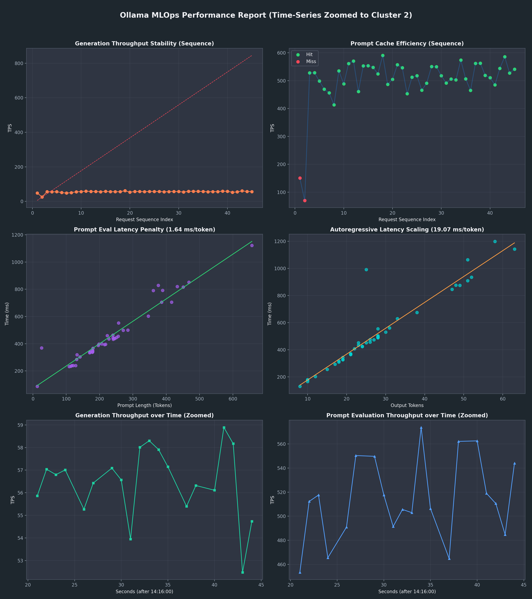
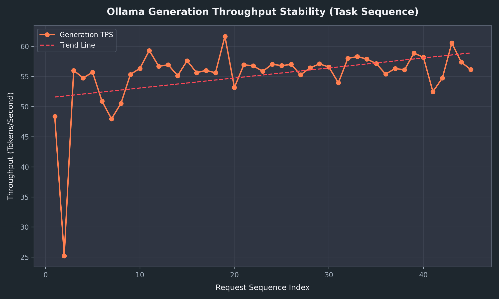
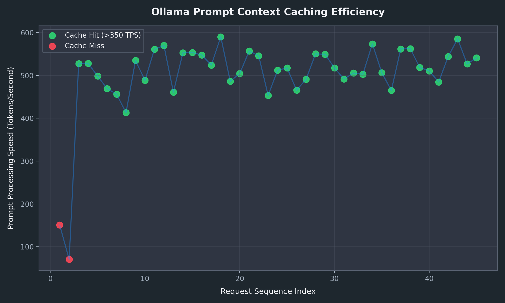
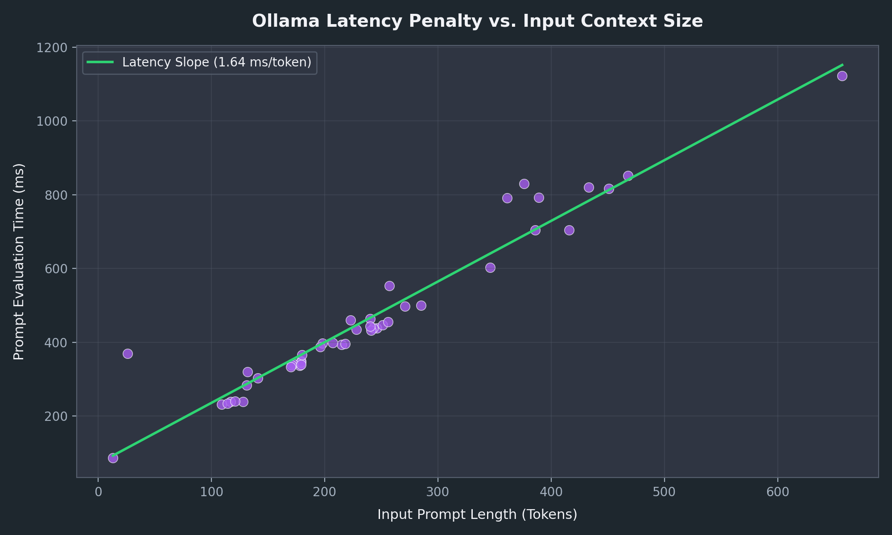
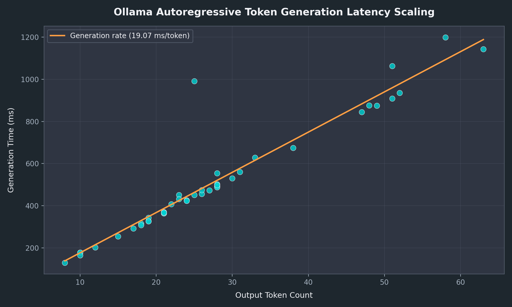
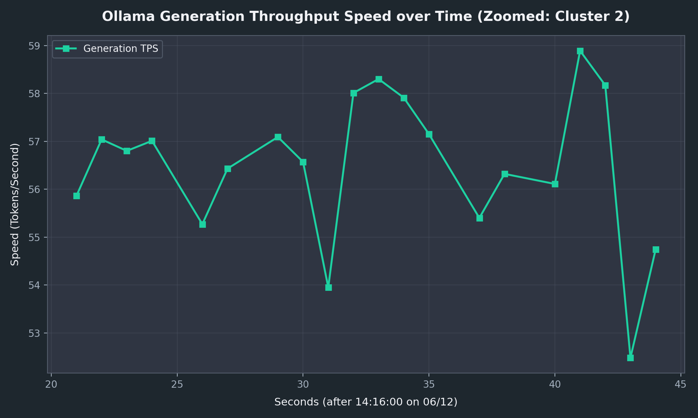
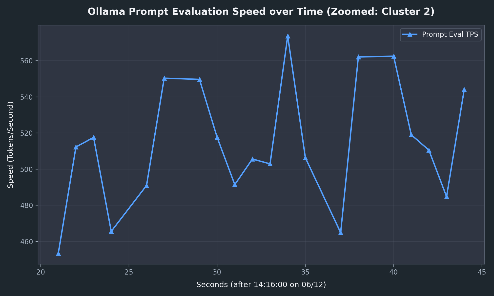

# Ollama Performance Analysis Report

This report presents a detailed analysis of local Ollama inference performance metrics extracted from `~/.ollama/logs/server.log` over the past two days (June 11–13, 2026).

---

## 1. Executive Summary: Combined Performance Metrics

Below is the combined 6-plot grid visualization capturing the key performance dimensions of prompt evaluation (pre-fill) and token generation (decoding) phases.

---

## 2. Interactive Performance Charts

You can view each chart in full detail, accompanied by technical explanations:

### Chart 1: Throughput Stability (Sequence)

* **Analysis**: Plots decoding speed (TPS) across requests. The dashed red trend line indicates overall throughput stability, demonstrating whether Apple Silicon Metal experiences any performance degradation or VRAM swapping during sequential evaluation loops.

---

### Chart 2: Prompt Context Cache Efficiency

* **Analysis**: Identifies prompt evaluation speed (TPS). Green points indicate successful cache hits (speed > 350 TPS) where prefix graphs were reused, while red points indicate cache misses where the full context had to be processed from scratch.

---

### Chart 3: Latency Penalty vs. Input Context Size

* **Analysis**: Displays the time taken to process prompts vs. prompt length. The green line shows the linear fit slope (ms per token), demonstrating how the context size (e.g. from retrieved mode noise) adds a pre-fill latency penalty.

---

### Chart 4: Autoregressive Token Generation Scaling

* **Analysis**: Illustrates generation time vs. output tokens. The slope represents the average decoding rate per token, while the y-intercept represents the base server overhead for executing requests.

---

### Chart 5: Generation Throughput Speed over Time

* **Analysis**: Displays generation TPS mapped chronologically, zoomed in on the active evaluation run (Cluster 2: June 12, 14:16:20 - 14:16:45). With the x-axis formatted in seconds, this high-resolution view captures the steady-state autoregressive decoding speed, showing a highly stable throughput hovering consistently between 52.5 and 58.9 TPS (mean: 56.5 TPS) over standard Metal execution threads.

---

### Chart 6: Prompt Evaluation Speed over Time

* **Analysis**: Plots prompt processing speed over time, zoomed in on the active evaluation run (Cluster 2: June 12, 14:16:20 - 14:16:45) at a seconds resolution. The chart reveals that all prompt evaluations are warm prefix-cache hits (ranging from 453.4 to 573.7 TPS with a mean of 514.3 TPS), verifying that Ollama successfully reused context embeddings and bypassed pre-fill compute overhead.
